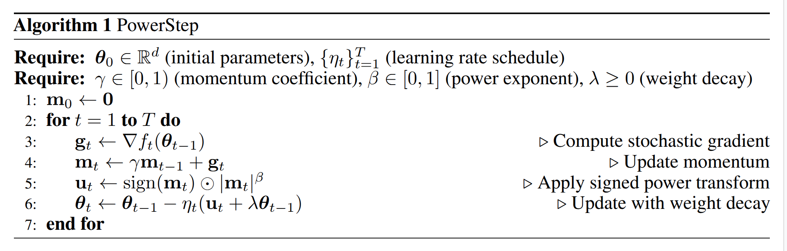

# PowerStep: Memory-Efficient Adaptive Optimization via $\ell_p$-Norm Steepest Descent

Official implementation of **PowerStep**, a memory-efficient optimizer that achieves coordinate-wise adaptivity without storing second-moment statistics. PowerStep matches AdamW's convergence while halving optimizer memory, and enables stable training under aggressive `int8` quantization for ~8× memory reduction.

📄 **Paper:** [PowerStep: Memory-Efficient Adaptive Optimization via $\ell_p$-Norm Steepest Descent](https://arxiv.org/abs/2605.10335)

---

## 📦 Overview

Adam and AdamW maintain two optimizer states per parameter (first and second momentum), doubling the memory footprint compared to SGD. PowerStep eliminates the second-moment buffer entirely by applying a **signed power transform** directly to the momentum:

This simple modification provides coordinate-wise adaptivity with **half the memory**, and the single-buffer design naturally supports aggressive `int8` quantization.

### Memory Use

