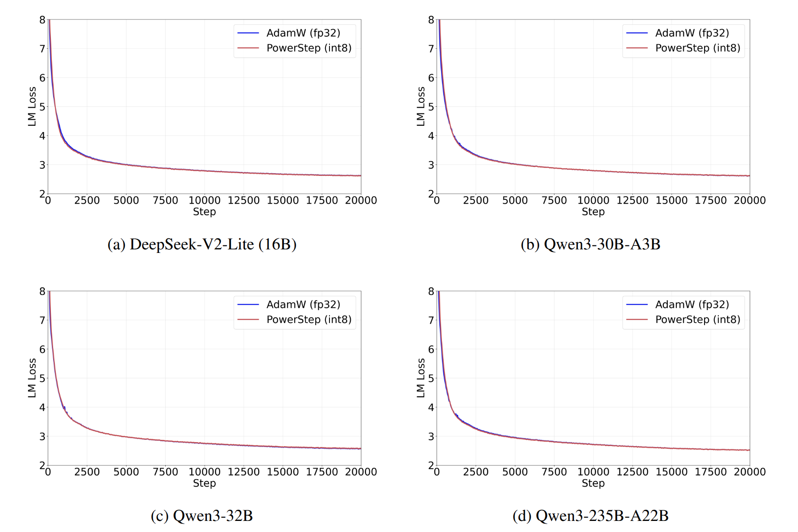
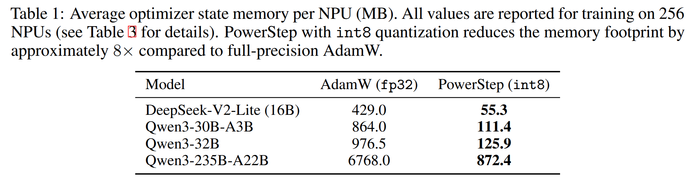

# PowerStep: Memory-Efficient Adaptive Optimization via $\ell_p$-Norm Steepest Descent

Official implementation of **PowerStep**, a memory-efficient optimizer that achieves coordinate-wise adaptivity without storing second-moment statistics. PowerStep matches AdamW's convergence while halving optimizer memory, and enables stable training under aggressive `int8` quantization for ~8× memory reduction.

[PowerStep: Memory-Efficient Adaptive Optimization via $\ell_p$-Norm Steepest Descent](https://arxiv.org/abs/2605.10335)

---

## Overview

Adam and AdamW maintain two optimizer states per parameter (first and second momentum), doubling the memory footprint compared to SGD. PowerStep eliminates the second-moment buffer entirely by applying a **signed power transform** directly to the momentum. This simple modification provides coordinate-wise adaptivity with **half the memory**, and the single-buffer design naturally supports aggressive `int8` quantization.


PowerStep matches AdamW's convergence for large-scale models



~8× memory reduction under `int8` quantization



## Code

### GPT-2 Experiments 

We use the [nanoGPT](https://github.com/karpathy/nanoGPT) codebase
```
cd nanoGPT
```
Modify `train.py` and `optim.py` to change or config optimizer and run
```
torchrun --standalone --nproc_per_node=8 train.py config/train_gpt2.py
```
for GPT-2-Small (124M) or 
```
torchrun --standalone --nproc_per_node=8 train.py config/train_gpt2_medium.py
```
for GPT-2-Medium (350M).
